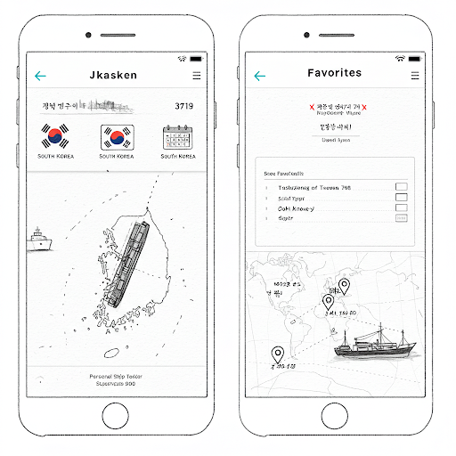

```
USER STORIES: (aka the "Who" and "Why")
I'd like to see the latest ports a vessel has traversed around South Korea or all the vessels at a South Korean port within the last 30 days.
I'd also like to be able to build a "subscription" of favorited vessels to have the complete history of.

ACCEPTANCE CRITERIA: (aka the "How")
When the user selects a port from the list it will show 
Example: (Bird Watching App) "When the user enters zip code and selects 'Rare' category, the app will display a list of rare bird sightings nearby."
Example: (Quick Recording App) "When the user selects 'Record button', the app will record with the mic, uploading to the shared drive."

FRAMEWORKS, APIs, and DATA:
The MERN stack (MongoDB, Express.js, React.js, Node.js)
Leaflet map
https://www.aishub.net/api
Airtable

MOCK UPS:
Create mockups of main pages (ideally, EVERY page!)
Hand-drawn and photographed with your phone is okay - just keep it legible!
Also okay: Using an image editor or other design software to create a mock-up (see below)
```

